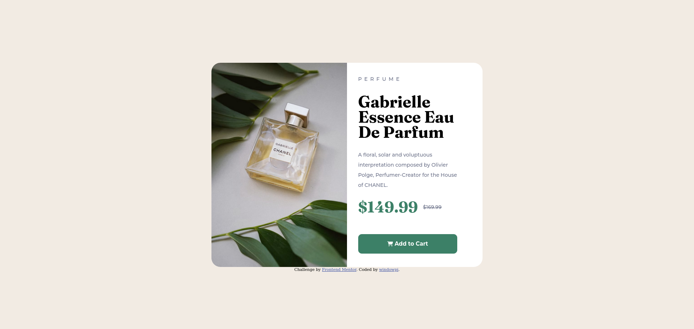

# Frontend Mentor - Product preview card component solution

This is a solution to the [Product preview card component challenge on Frontend Mentor](https://www.frontendmentor.io/challenges/product-preview-card-component-GO7UmttRfa). Frontend Mentor challenges help you improve your coding skills by building realistic projects. 

## Table of contents

- [Overview](#overview)
  - [The challenge](#the-challenge)
  - [Screenshot](#screenshot)
  - [Links](#links)
- [My process](#my-process)
  - [Built with](#built-with)
  - [What I learned](#what-i-learned)
  - [Continued development](#continued-development)
  - [Useful resources](#useful-resources)
- [Author](#author)
- [Acknowledgments](#acknowledgments)


## Overview

### The challenge

Users should be able to:

- View the optimal layout depending on their device's screen size
  * Only have to desktop version done for now. Will return and get the mobile version done.
- See hover and focus states for interactive elements

### Screenshot




- Solution URL: [GitHub](https://github.com/windowpi/product-preview)
- Live Site URL: [GitHub-Pages](https://windowpi.github.io/product-preview/)

## My process

### Built with

- Semantic HTML5 markup
- CSS custom properties
- Flexbox
- [Font-Awesome](https://fontawesome.com/v5/cheatsheet/free/brands)

### What I learned

I learned how to make a product card with an image on the left and text on the right. Learned how to make a border-radius with only the left side having the rounded edges. Learned how to make a button change color when hovering over it. Learned how to add in font awesome icons using a script tag instead of a link tag. Learned how to have text have a line through it.

```html
<script src="https://kit.fontawesome.com/3f5948218d.js" crossorigin="anonymous"></script>

<button class="cart">
  <span class="fa-solid fa-shopping-cart"></span> Add to Cart
</button>
```
```css
.cart:hover {
  background-color: hsl(212, 21%, 14%);
}

#normal {
  text-decoration-line: line-through;
}

.image img {
  border-radius: 25px 0px 0px 25px;
}
```

### Continued development

I need to focus on improving my implementation of flexbox and properly writing semantic html. Also need improving on writing html with accessibility in mind. 

## Author

- Website - [windowpi](https://github.com/windowpi)
- Frontend Mentor - [@windowpi](https://www.frontendmentor.io/profile/windowpi)

## Acknowledgments

Would like to thank [Melvin](https://www.frontendmentor.io/profile/MelvinAguilar) and [Hassia](https://www.frontendmentor.io/profile/Hassiai) for giving me a few pointers on how to format my flexbox and better use of semantic html with accessibility in mind. 
